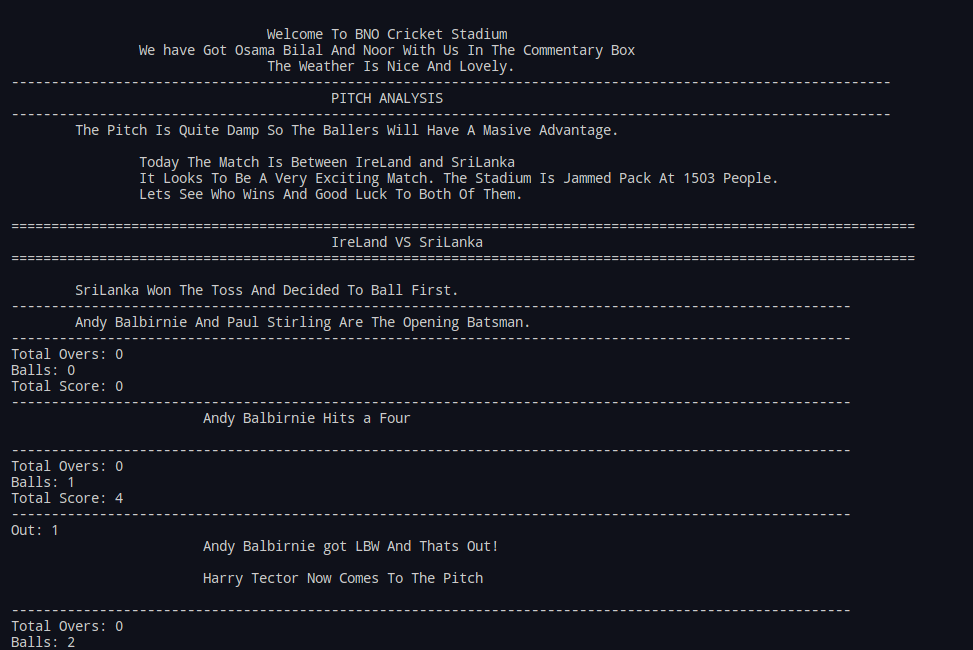
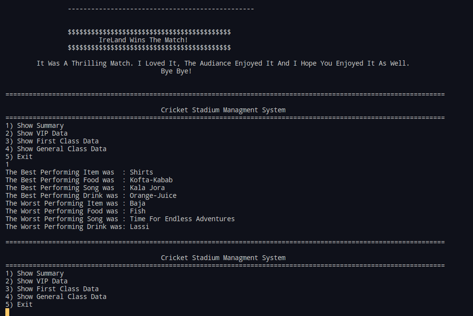

# Cricket-Man-Sim
Cricket Simulation And Cricket Stadium Managment System
# ScreenShots:

# This Project Used Template Classes. 
## The implementation of template classes are inside `Templates` folder. 
## During compilation `templates` should not be a part of the project file.
## The `header` files of the `Templates` at the very end have a `#include "NameOfClas.cpp"` which makes the compiler able to understand how to compile when the datatype is unknown.
### [A Good Resource For Understanding How To Seperate Template Classes Into Different Files](https://www.codeproject.com/Articles/48575/How-to-Define-a-Template-Class-in-a-h-File-and-Imp)