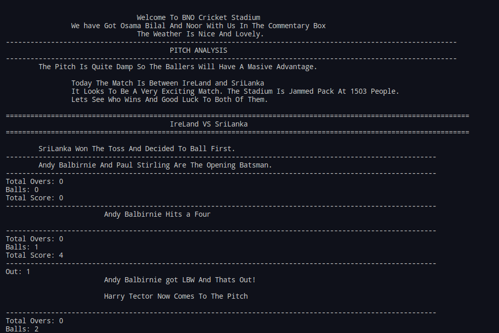
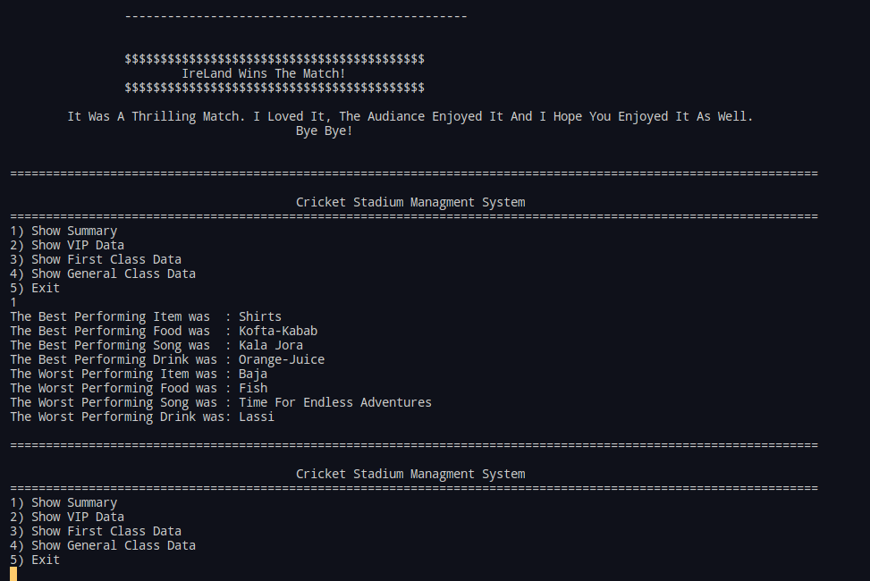

# Cricket-Man-Sim
Cricket Simulation And Cricket Stadium Managment System
# ScreenShots:





# This Project Used Template Classes. 
## The implementation of template classes are inside `Templates` folder. 
## During compilation `templates` should not be a part of the project file.
## The `header` files of the `Templates` at the very end have a `#include "NameOfClass.cpp"` which makes the compiler able to understand how to compile when the datatype is unknown.
### [A Good Resource For Understanding How To Seperate Template Classes Into Different Files](https://www.codeproject.com/Articles/48575/How-to-Define-a-Template-Class-in-a-h-File-and-Imp)
# Note:
## The executable file should be in a folder where it can access the `Resources` folder's contents. If you want to change it go to `srcs/Stadium.cpp` line 146. The function `Store_Name_In_Queue` has a file path:
```cpp
MyFile.open("../Resources/Audiance-Data/"+GetFileName()+".txt",std::ios::in);//Read Mode
```
Change the file path to whatever you want.